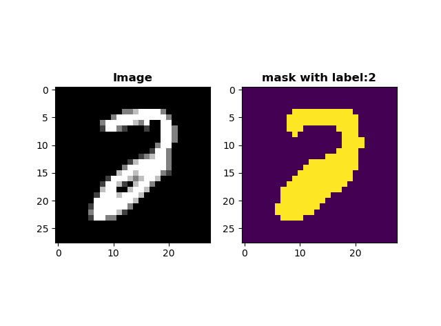
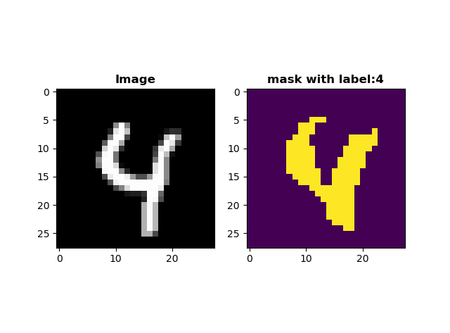
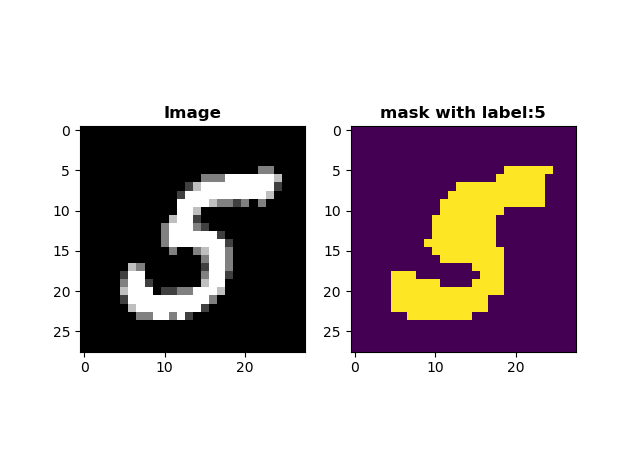
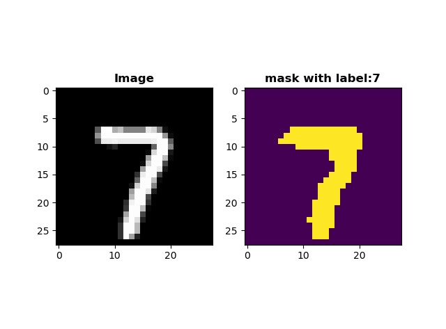

# DeeplabV3+-Retraining
# 使用自己的数据集Retraining DeeplabV3+

### 要求：
tensorflow-1.10.0 
keras-2.1.6 

### 说明：
使用的MNIST数据集进行的一个简单的fine tune的演示。 
需要使用自己的其他数据集，只需要修改模型的input_shape, classes以及选择想用的backbones，并写好自己的data_generator喂数据就好了。
如果你有GPU，修改train.py中的use_gpu为True并设置gpus为你的gpu个数。 
建议在gpu上训练。 

### 训练：
train.py能直接运行并开始训练MNIST数据集。 
Keras会自动下载mnist数据集文件:mnist.npz，并且会自动下载预训练好的模型参数文件:deeplabv3_xception_tf_dim_ordering_tf_kernels.h5，deeplabv3_mobilenetv2_tf_dim_ordering_tf_kernels.h5基于你选用的不同backbones。 

### 一些训练完毕的效果图片:

    
     
    
     

### Reference
- [Shmuelnaaman's Deeplab_V3](https://github.com/Shmuelnaaman/deeplab_v3)
- [TensorFlow Official Models](https://github.com/tensorflow/models/tree/master/research/deeplab)
